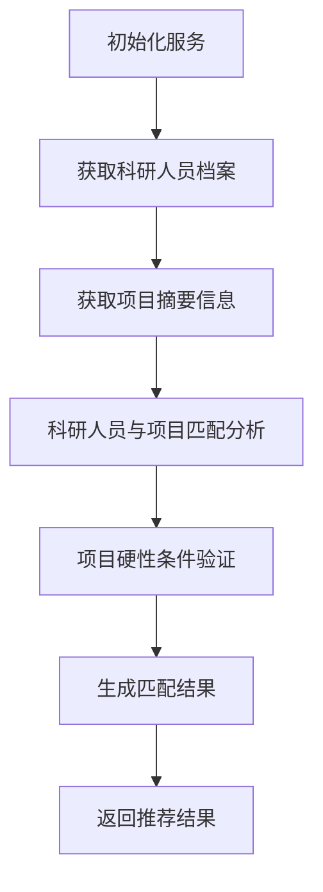

# Recommend Projects for Professional Analysis Service 模块说明

## 模块概述

Recommend Projects for Professional Analysis Service 是一个智能推荐系统模块，用于分析科研人员与科研项目的匹配度。该模块通过深度分析科研人员的专业技能、学术背景、学术成果、实践经验、跨学科合作能力和技术创新能力等关键指标，结合科研项目的具体目标与需求，从多维度评估科研人员与科研项目的匹配程度。

该模块主要功能包括：
1. 科研人员与科研项目多维度匹配分析
2. 项目硬性条件验证
3. 匹配度评分和优先级推荐

## 架构设计

### 核心类

#### RecommendProjectsForProfessionalAnalysisService
这是模块的核心类，负责处理科研人员与项目的匹配分析。

**构造函数参数：**
- `project_ids`: 项目ID列表
- `professional_personnel_id`: 科研人员ID

**主要属性：**
- `chatbot`: AI聊天机器人实例，用于生成分析结果
- `project_ids`: 项目ID列表
- `professional_personnel_id`: 科研人员ID
- `project_summaries`: 项目摘要列表
- `profile`: 科研人员档案信息
- `match_results`: 匹配结果列表

**主要方法：**

1. `initialize_profile_and_summary()`: 
   初始化科研人员档案和项目摘要信息

2. `project_match_professional_personnel_single_agent(project_summary_content, profile_content)`:
   单个项目与科研人员匹配分析，使用AI模型评估匹配度

3. `project_hard_conditions_match_agent(project_hard_conditions, professional_personnel_base_info)`:
   项目硬性条件匹配验证，验证科研人员是否满足项目的硬性要求

4. `type_change(answer)`: 
   解析AI模型返回的JSON格式结果

5. `create_match_result(data, personnel_id, project_id)`: 
   创建匹配结果对象

6. `project_match_professional_personnel()`: 
   主要的匹配分析流程，整合所有分析结果

### 数据结构

#### ProfileSchema
科研人员档案信息结构：
- `professional_personnel_id`: 科研人员ID
- `professional_personnel_name`: 科研人员姓名
- `professional_personnel_base_info`: 科研人员基本信息
- `profile_content`: 科研人员详细档案内容

#### ProjectSummarySchema
项目摘要信息结构：
- `project_id`: 项目ID
- `project_name`: 项目名称
- `project_summary_content`: 项目摘要内容
- `leader_education_limit`: 负责人学历要求
- `leader_age_limit`: 负责人年龄要求
- `leader_title_limit`: 负责人职称要求

#### MatchResult
匹配结果结构，包含：
- 基本信息（科研人员ID、项目ID等）
- 各维度匹配度评分（技能、背景、成果、经验、跨学科能力、创新能力）
- 总体匹配评分和推荐等级
- 计算过程信息

### 工作流程



### 分析维度

1. **专业技能匹配**: 评估技术能力、工具掌握情况是否满足项目需求
2. **学术背景匹配**: 根据教育背景、研究领域与项目相关性进行对比
3. **学术成果匹配**: 分析论文数量与质量、专利申请记录等
4. **实践经验匹配**: 评估科研经历与项目相关性
5. **跨学科合作能力匹配**: 分析团队合作和跨学科任务经验
6. **技术创新能力匹配**: 评估创新成果和技术开发能力

### 评分机制

每个维度评分范围为0-10分，权重分配如下：
- 专业技能: 30%
- 学术背景: 20%
- 学术成果: 15%
- 实践经验: 15%
- 跨学科合作能力: 10%
- 技术创新能力: 10%

总分为各维度加权计算结果，范围为0-10分。

### 硬性条件验证

模块还包含一个专门的硬性条件验证机制，用于检查科研人员是否满足项目的硬性要求：
- 学历要求
- 职称要求
- 年龄要求

验证结果分为三种情况：
1. 符合硬性条件
2. 不符合硬性条件
3. 专业人员缺失信息无法确定

### 提示词管理

模块使用外部文件管理AI模型的提示词，便于维护和更新：
- [project_personnel_match_prompt.txt](file:///e:/pyProject/teleProject/prompts/project_personnel_match_prompt.txt): 项目与人员匹配分析提示词
- [hard_conditions_match_prompt.txt](file:///e:/pyProject/teleProject/prompts/hard_conditions_match_prompt.txt): 硬性条件验证提示词

这种设计使得提示词可以独立于代码进行维护，并支持A/B测试和优化。

## 使用示例

```python
# 创建服务实例
service = RecommendProjectsForProfessionalAnalysisService(project_ids=[1, 2, 3], professional_personnel_id=12)

# 初始化数据
await service.initialize_profile_and_summary()

# 执行匹配分析
await service.project_match_professional_personnel()

# 获取结果
for match_result in service.match_results:
    print(match_result)
```

## 依赖关系

- sapperrag.llm.oai.ChatOpenAI: AI模型接口
- backend.core.conf.settings: 配置管理
- backend.app.techmanage.schema: 数据结构定义
- backend.app.techmanage.service: 数据服务接口